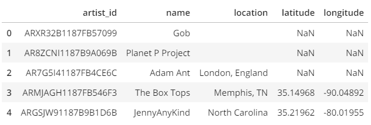

# Project 1 - Data Modeling with Postgres

## Table of Conents
1. [Introduction](#introduction)
2. [ETL](#etl)
3. [Run Scripts](#run-scripts)
4. [File Explanations](#additional-files)

## Introduction

The purpose of this project is to create data models (represented as tables in a PostgreSQL database) that represent Sparkify's data collected from their music streaming service.  Additionally, after creating the tables in the database, an ETL process is developed that moves data from JSON files (where they're unable to be analyzed) to the appropriate tables in the PostgreSQL database.

## ETL

Sparkify's data is essentially broken apart into two files:  **songs** and **log**

### Songs

A single file describes one song:  the name of the song, the artist, the length of the song, and the artist's location.  In order to reduce data duplication, contents of a single file are broken apart into two tables:  songs and artists.

A sample of the data, as represented by both tables, is shown below:

**Songs**


**Artists**



### Log

The log file shows how their service is being utilized.  Through this file you can begin to answer some of the questions below:

- What songs are being played?
- When are songs being played?
- Who is listening?
- Where are users located?
- What kind of users (free vs. paid) utilize the service?

A sample of the data is shown below:


### Process

The song files and log files go through a similar process prior to being inserted into the database.

1. Collect all files
2. Loop through all files, clean data, and append into respective lists to be inserted in bulk at a later point
3. Insert data into database in specific order (accounting for Foreing Keys)

### Clean Data

#### Log

First, we need to filter the data so that only played songs are included:

```python
df = df[df.page == 'NextSong']
```

Second, we need to convert the timestamp column to datetime:

```python
df['ts'] = pd.to_datetime(df['ts'], unit='ms')
```

#### Songs

The only thing we need to do for the song file is to convert any NaN values to None::

```python
df = df.where(pd.notnull(df), None)
```

## Run Scripts

First, you want to make sure that the tables exist in the database.  Run the following command::

    $ python create_tables.py

Second, run the ETL script to transfer data from the json files to the newly created tables::

    $ python etl.py

## Additional Files

### Jupyter Notebooks

- Analysis.ipynb:  Analyze some of the data per Sparkify's stated objective
- test.ipynb:  Test whether or not data is actually getting into the database

### Python

- create_tables.py:  Connect to database and create tables specified in sql_queries.py
- sql_queries.py:  SQL statements to execute (CREATE, INSERT, SELECT)
- etl.py:  Functions utilized to extract, transform, and load data from json to postgresql
